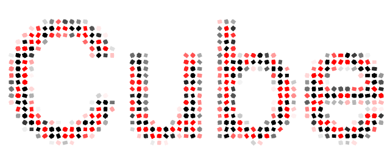

# CubeText

[](https://lerna.js.org/)



Render text with customizable cubes using webgl.

# This package is currently Work-In-Progress so API specs may change occasionally. Keep in mind if you use it at the production level.

## Installation

```shell
> yarn add @paosder/cube-text
> yarn add @paosder/react-cube-text # react component version. (optional)
```

## Usage

```typescript
// parent or ancient element must have fixed height.
const cubeText = new CubeText("wrapper");

// set cube random color with ratio.
cubeText.register("init-cube", generateRandomColor());
// set random rotation of cube.
cubeText.register("init-cube", randomRotate);
// set random position of cube.
cubeText.register(
  "init-cube",
  generateRandomPosition({ basis: true, min: [-1000, -1000, -1000] })
);
// set gradient color.
cubeText.register("init-cube", generateGradientColor());
// rewind cube position to origin. It is used with randomPosition.
cubeText.register("render", generateRewindToOrigin({ duration: 5000 }));
// fill the text full-screen.
cubeText.register("render-camera", generateFullscreen());
// rotate y axis.
cubeText.register(
  "render-camera",
  generateRotateY({
    duration: 5000,
    loop: false,
  })
);
// zoom out 0.1 to 1.0.
cubeText.register(
  "render-camera",
  generateZoom({
    init: 0.1,
    targetRatio: 1,
    duration: 5000,
  })
);
// set text.
const drawText = "Hello CubeText!";
// draw it.
cubeText.drawText(drawText);
// then run to render every frame.
cubeText.run();
```

## API

**Type definitions are already included in the package, but not just documented yet.**

Work-in-Progress.

## Development

```shell
# 1. watch essential local packages: `gl-variable`, `gl-world`.
> yarn dev
# 2. run dev server (playground or storybook).
> yarn dev:webpack # run playground
> yarn dev:storybook # run storybook
```
