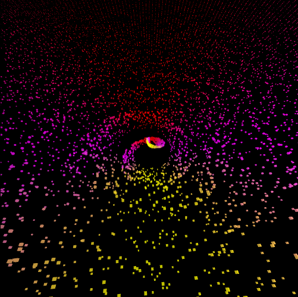

# gl-variable




Use webGL1 attribute and uniform easily.

## This is not documented yet, but type definitions are provided.

## Install
```shell
> yarn add @paosder/gl-variable @paosder/vector-map
```


## Usage

```typescript
const gl: WebGLRenderingContext = ...;
const program: WebGLProgram = ...;

const cubes: GLVariable = createGLVariable(gl, program, {
  surface: {
    name: 'a_surface',
    type: 'attribute',
    size: 3,
    length: 24,
    usage: gl.STATIC_DRAW,
    defaultData: points,
  },
  color: {
    name: 'a_color',
    type: 'attribute',
    size: 4,
    usage: gl.DYNAMIC_DRAW,
    length: DEFAULT_CUBE_LENGTH,
    instanced: 1,
  },
  position: {
    name: 'a_position',
    type: 'attribute',
    size: 3,
    usage: gl.DYNAMIC_DRAW,
    length: DEFAULT_CUBE_LENGTH,
    instanced: 1,
  },
  rotation: {
    name: 'a_rotation',
    type: 'attribute',
    size: 4,
    matrix: true,
    usage: gl.DYNAMIC_DRAW,
    length: DEFAULT_CUBE_LENGTH,
    instanced: 1,
  },
  size: {
    name: 'a_size',
    type: 'attribute',
    size: 1,
    usage: gl.DYNAMIC_DRAW,
    length: DEFAULT_CUBE_LENGTH,
    instanced: 1,
  },
});

interface SomeOptions {
    color: Color;
    position: Coordinate;
    rotation: RotationMat;
    size: [number];
}

const options: SomeOptions = { ... };
const id = 'test-object';

addObject(cubes, id, options);

getAttribArray(cubes, id, 'position', (bufferArr: Float32Array) => {
  bufferArr[0] = 1; // change subarray data.
  bufferArr[1] = 0;
  bufferArr[2] = 1;

  return true; // we should return true when we change data and wants to refresh.
});

// Update variable. We should call this function after VAO is plugged in.
updateVariable(gl, program, cubes);

```

## API

